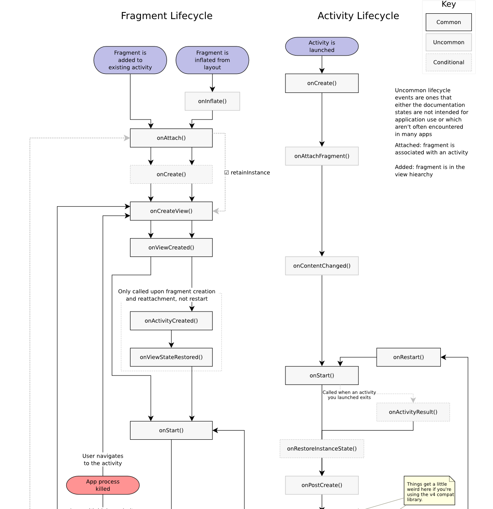
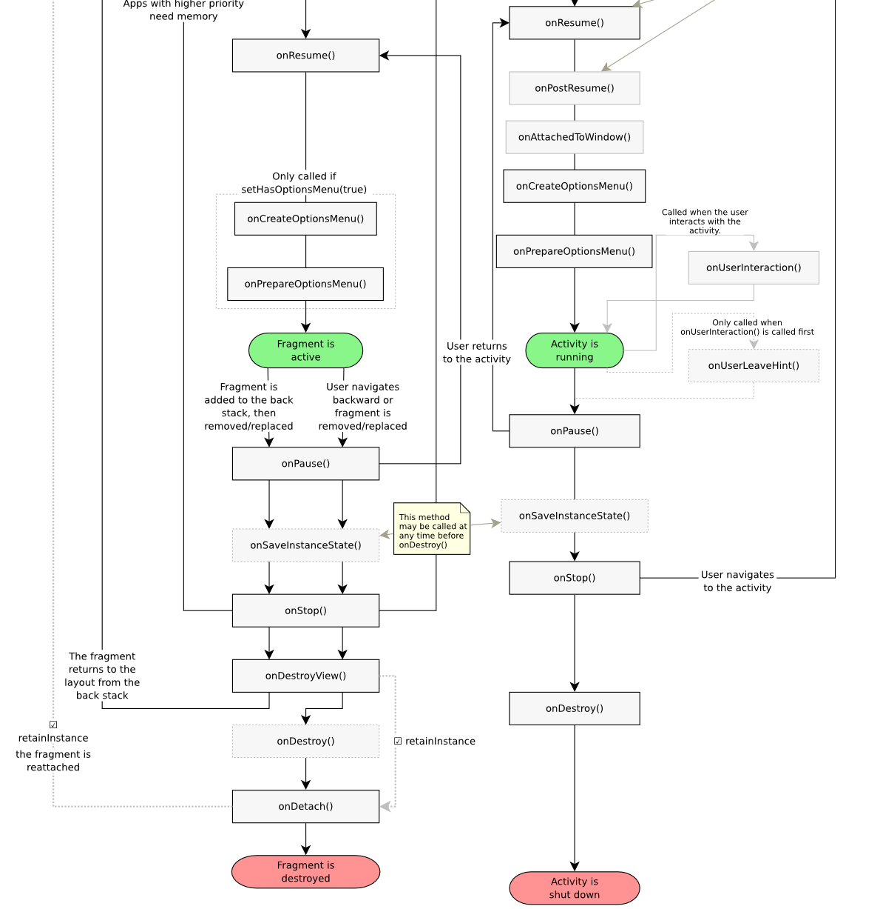
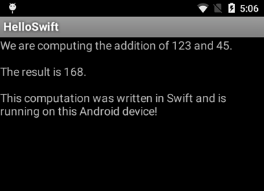
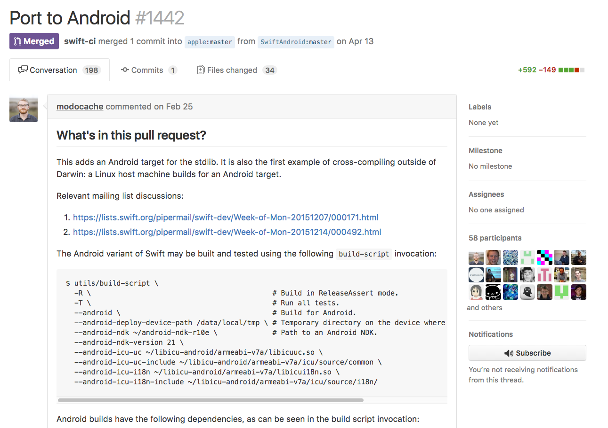
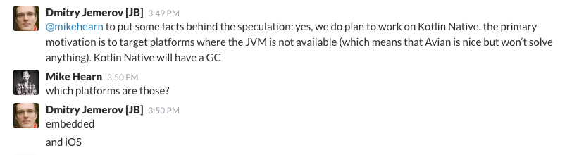

<!-- $theme: gaia -->
<!-- *template: invert -->

<!-- $size: 16:9 -->

# Swift on Android
###### by Sebastian Chlan

---
<!-- *template: invert -->

# Android 101
#### [~~Swift on Android~~]
###### by Sebastian Chlan

---
<!-- page_number: true -->

##### Android Fragment & Activity Lifecycle
 
  

---
<!-- *template: invert -->

# Swift on Android
###### by Sebastian Chlan

---
### Where did it start?
<br/>

- Pioneers:
  - \> [Romain Goyet](http://romain.goyet.com/articles/running_swift_code_on_android/)
  - [Zhuowei Zhang]()
  - [Brian Gesiak]()
  - [Geordie J.]()

--- 

### First POC
```swift
// add.swift
func addTwoNumbers(first: UInt8, second: UInt8) -> UInt8 {
  return first + second
}
```

1. Compile the intermediate representation 
1. Use LLVM to create an ARM object file
1. Create a JNI bridge	

---
### First POC
<br>




---

### Where did it start?
<br/>

- Pioneers:
  - [Romain Goyet](http://romain.goyet.com/articles/running_swift_code_on_android/)
  - \> [Zhuowei Zhang]()
  - \> [Geordie J.]()
  - [Brian Gesiak]()
  
---

### Where did it start?

 

<!-- add an image of the guys -->

---
<!-- *template: invert -->

# ==NOPE==

--- 

### What can we do today?
<br>

- Compile and Swift code and execute it on emulators/rooted phones
- Call Swift code from Java and vice versa

---

### How is it done?

- Setup
  - Linux environment [==Ubuntu (>15.04)==]
```
git cmake ninja-build clang python uuid-dev libicu-dev icu-devtools libbsd-dev libedit-dev libxml2-dev libsqlite3-dev 
swig libpython-dev libncurses5-dev pkg-config libblocksruntime-dev libicu-dev autoconf automake libtool
```
  - ==Android NDK== (r12)
  - Clone ==apple/swift== 
  - Clone ==SwiftAndroid/libiconv-libicu-android.git== 

---

### How is it done?
- Compile
  - `libiconv` and `libicu`
  -  Swift standard library
```bash
utils/build-script \
    -R \                                       # Build in ReleaseAssert mode.
    --android \                                # Build for Android.
    --android-ndk /path/to/android-ndk-r12 \   # Path to an Android NDK.
    --android-api-level 21 \                   # The Android API level to target. Swift only supports 21 or greater.
    --android-icu-uc /path/to/libicu-android/armeabi-v7a \
    --android-icu-uc-include /path/to/libicu-android/armeabi-v7a/icu/source/common \
    --android-icu-i18n /path/to/libicu-android/armeabi-v7a \
    --android-icu-i18n-include /path/to/libicu-android/armeabi-v7a/icu/source/i18n/
```

---

### How is it done?

- Build
```bash
build/Ninja-ReleaseAssert/swift-linux-x86_64/bin/swiftc \                      # The Swift compiler built in the previous step.
    -target armv7-none-linux-androideabi \                                       # Targeting android-armv7.
    -sdk /path/to/android-ndk-r12/platforms/android-21/arch-arm \                # Use the same NDK path and API version as you used to build the stdlib in the previous step.
    -L /path/to/android-ndk-r12/sources/cxx-stl/llvm-libc++/libs/armeabi-v7a \   # Link the Android NDK's libc++ and libgcc.
    -L /path/to/android-ndk-r12/toolchains/arm-linux-androideabi-4.9/prebuilt/linux-x86_64/lib/gcc/arm-linux-androideabi/4.9 \
    hello.swift
```

---
<!-- *template: invert -->

### Demo

--- 

### Swift <--> JNI <--> Android App


---


### Conclusion


---

### Kotlin
<br>




---

### References
- http://romain.goyet.com/articles/running_swift_code_on_android/
- \*lol\* http://thenextweb.com/dd/2016/04/07/google-facebook-uber-swift/ 
- https://medium.com/@ephemer/why-we-put-an-app-in-the-android-play-store-using-swift-96ac87c88dfc
- https://github.com/apple/swift/blob/master/docs/Android.md
- https://github.com/SwiftAndroid


--- 
<!-- *template: invert -->
# Thanks!
##### https://github.com/schlan
##### [@sebchlan](https://twitter.com/sebchlan)


